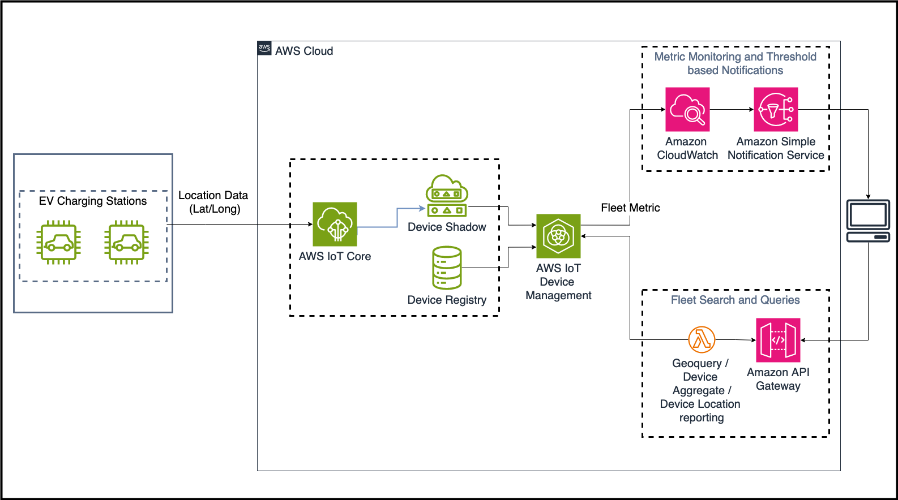

# Using location data with AWS IoT Device Management  to monitor and manage your IoT device fleet
    

      
## Description

This repository contains resources for the blog post "Using location data with AWS IoT Device Management  to monitor and manage your IoT device fleet":
1. [createResources.sh](createResources.sh) : Script to create resources needed for build out of the solution elaborated in the blog. This script uses bulk provisioning APIs to creates Things (name and number as passed in the arguments). The script creates the required resoures such as a S3 bucket to store bulk provisioning files, a role to porvide IoT Core access on this S3 bucket, a thing type, a thing group for the created things and a policy and principal to govern the identity and authorization for the things. 
2. [cleanupResources.sh](cleanupResources.sh): Script to delete the resources and the temporary files created by createResource.sh
3. [deleteThing.sh](deleteThing.sh): Used internally by cleanupResources.sh to delete the created things
4. [updateShadows.sh](updateShadows.sh): Wrapper script to install edpendencies and invoke RunShadowClients.py
5. [RunShadowClients.py](RunShadowClients.py): Python script to iterate over created things and update their shadows
6. [ShadowClient.py](ShadowClient.py): Python script to establish MQTT connection with AWS IoT Core and invoke Shadow APIs.
7. [blog_fi_geoquery_policy.json](blog_fi_geoquery_policy.json) : Policy file defining the access permissions for the Thing created by createResource.sh
8. [s3-access-role.json](s3-access-role.json): JSON file containing IAM policy to allow IoT Core access on S3 bucket
9. [templateBody.json](templateBody.json): template file used for bulk provisioning of things

## Security

See [CONTRIBUTING](CONTRIBUTING.md#security-issue-notifications) for more information.

## License

This library is licensed under the MIT-0 License. See the [LICENSE](LICENSE) file.

## Support
reetesh@amazon.com, satejs@amazon.com, surabhta@amazon.com

## Authors and acknowledgment
satejs@amazon.com, 
surabhta@amazon.com,
https://github.com/aws-samples/aws-iot-device-management-workshop.git

